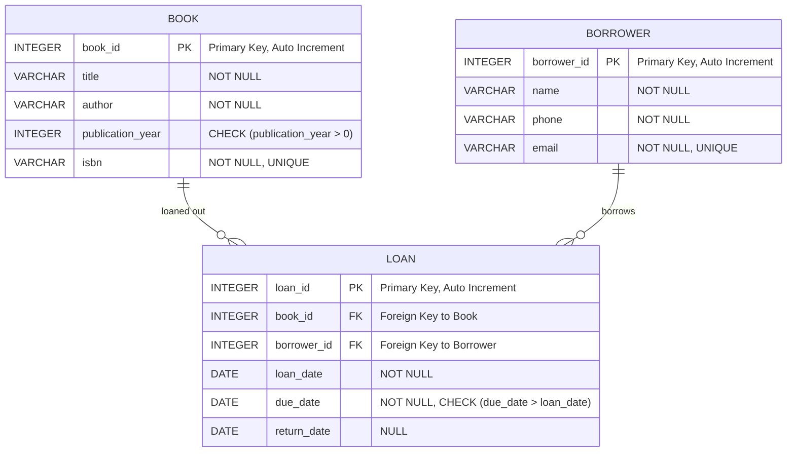

## ER diagram


-----------------------------------------------------


## UML diagram
```mermaid
classDiagram
    class Book {
        +Integer book_id
        +String title
        +String author
        +int publication_year "CHECK (publication_year > 0)"
        +String isbn "CHECK (LENGTH(isbn) BETWEEN 10 AND 13)"
    }

    class Borrower {
        +Integer borrower_id
        +String name
        +String phone "CHECK (LENGTH(phone) BETWEEN 7 AND 15)"
        +String email
    }

    class Loan {
        +Integer loan_id
        +Integer book_id
        +Integer borrower_id
        +Date loan_date
        +Date due_date "CHECK (due_date > loan_date)"
        +Date return_date
    }

    Book "1" --o "0..*" Loan : "loaned out"
    Borrower "1" --o "0..*" Loan : "borrows"

   ```
-----------------------------------------------------
## SQL code
    
### Insert data
INSERT INTO Book (title, author, publication_year, isbn) VALUES ('The Hobbit', 'J.R.R. Tolkien', 1937, '9780345339683');
INSERT INTO Borrower (name, phone, email) VALUES ('Anna Svensson', '0701234567', 'anna.svensson@mail.com');
INSERT INTO Loan (book_id, borrower_id, loan_date, due_date) VALUES (1, 1, '2024-01-01', '2024-01-15');

### Select data
SELECT * FROM Book;
SELECT * FROM Borrower;
SELECT * FROM Loan;

### Update data
UPDATE Book SET title = 'The Hobbit: Illustrated Edition' WHERE book_id = 1;
UPDATE Loan SET return_date = '2024-01-14' WHERE loan_id = 1;

### Delete data
DELETE FROM Loan WHERE loan_id = 1;
DELETE FROM Borrower WHERE borrower_id = 1;
DELETE FROM Book WHERE book_id = 1;

### Implementing views
CREATE VIEW Borrower_Loans AS
SELECT Borrower.name, Borrower.email, Book.title, Loan.loan_date, Loan.due_date, Loan.return_date
FROM Borrower
JOIN Loan ON Borrower.borrower_id = Loan.borrower_id
JOIN Book ON Loan.book_id = Book.book_id;

CREATE VIEW Overdue_Loans AS
SELECT Book.title, Borrower.name, Loan.due_date
FROM Loan
JOIN Book ON Loan.book_id = Book.book_id
JOIN Borrower ON Loan.borrower_id = Borrower.borrower_id
WHERE Loan.return_date IS NULL AND Loan.due_date < DATE('now');


## Security Considerations

To implement a secure login function for the library system, users will enter their credentials in a login form. The system will retrieve the stored hashed password from the database and hash the input password for comparison. If both hashed values match, the user is authenticated successfully and granted access. A strong password policy should be enforced, requiring at least 8 characters with a combination of numbers and special symbols. Passwords must be securely stored using hashing algorithms such as bcrypt. To prevent SQL injection attacks, all database queries should be executed using prepared statements, ensuring that user input is treated strictly as data. Additionally, session management should be properly handled to maintain authentication states, and failed login attempts should be logged to detect any unusual behavior or brute-force attempts.

Prepared statements are essential for preventing SQL injection attacks. Instead of embedding user input directly into SQL queries, placeholders are used, which ensures that user input is not interpreted as executable code. This technique separates the SQL logic from the input data, making it impossible for an attacker to manipulate queries.

One common database attack vector is SQL injection, where an attacker manipulates SQL queries by inserting malicious input through login forms or URLs. For example, a vulnerable query:

SELECT * FROM Users WHERE username = 'admin' OR '1'='1' AND password = '';

## Analysis and Reflection

### Normalization and Structure

The database is designed following 3NF to reduce redundancy and ensure consistency. Each table stores unique data, improving maintainability.

### Primary and Foreign Keys

AUTOINCREMENT is used for primary keys to ensure unique identifiers. Foreign keys establish relationships between tables, maintaining referential integrity. ISBN is unique but not a primary key to allow tracking of multiple editions.

### Performance and Constraints

Indexes on frequently queried fields such as borrower names and book titles could improve performance. Constraints like CHECK ensure data integrity, validating ISBN format, phone number length, and loan dates.

### Deletion Policies

ON DELETE CASCADE has been avoided to prevent accidental deletion of related records, ensuring historical data remains intact.

### Scalability

SQLite is used for its lightweight nature, suitable for small applications. For larger systems, PostgreSQL or MySQL would be preferable. Future improvements could include role-based access control for security.


## Documentation and Setup Instructions

### Database Structure
Book Table: Stores details about books, including title, author, publication year, and ISBN.

Borrower Table: Contains borrower details like name, phone, and email.

Loan Table: Tracks book loans and returns, linking books and borrowers.


### Setup Instructions

Install SQLite3 if not already installed.

### SQL Script Descriptions

create.sql: Defines the database schema, including tables and constraints.

populate.sql: Inserts sample data for books, borrowers, and loans.

queries.sql: Contains SQL queries for retrieving loaned books, overdue books, and borrower history.

This structured approach ensures that the system remains efficient, secure, and scalable, maintaining high data integrity and ease of use.